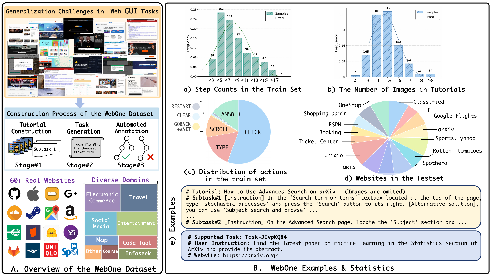
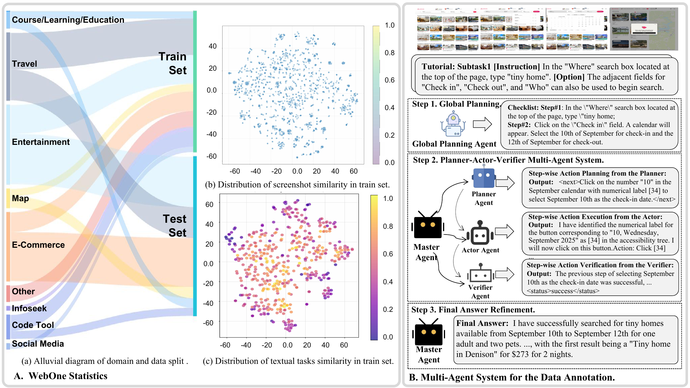
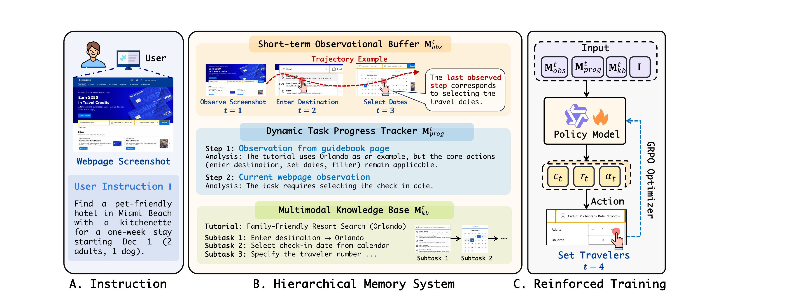
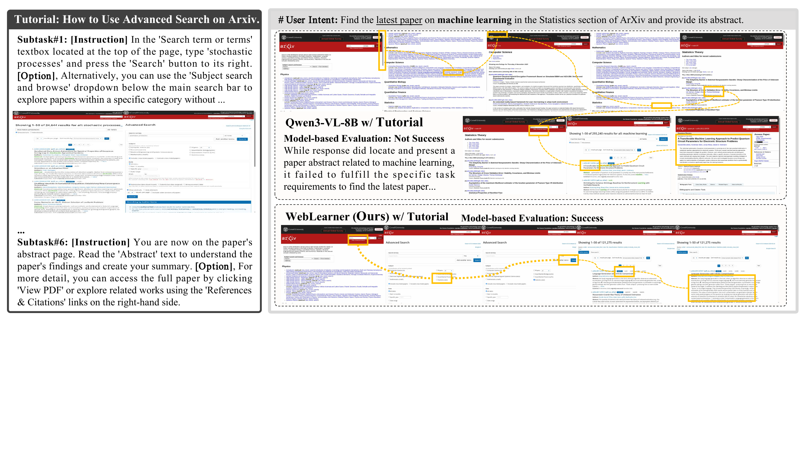

# Guiding the Blind: Generalizing GUI Agents to Unseen Websites via Multimodal Tutorials

*Keywords: Web GUI Agents, Large Multimodal Models, Unseen Website Generalization, Multimodal Tutorials, Reinforcement Learning*

---

Xinwei Long1*, Kai Tian1*, Peng Xu1, Weibo Gao3, Yihua Shao4, Guoli Jia1, Haozhe Geng3, Sa Yang3, Jingxuan Li6, Huayong Hu6, Kaiyan Zhang1, Jiaqi Wang2+, Bowen Zhou1,2+

$^{1}$ **Tsinghua University** &nbsp;&nbsp; $^{2}$ **Shanghai AI Lab** &nbsp;&nbsp; $^{3}$ **Peking University** &nbsp;&nbsp; $^{4}$ **USTC** &nbsp;&nbsp; $^{5}$ **CASIA** &nbsp;&nbsp; $^{6}$ **Independent Researcher**

* Equal Contribution &nbsp;&nbsp; + corresponding authors

 

* Equal Contribution &nbsp;&nbsp; + Corresponding Authors

---

    🔗 <b>[<a href="https://arxiv.org/abs/URL_HERE">arXiv Paper</a>]</b> 
    &nbsp;&nbsp;&nbsp;&nbsp;📊 <b>[<a href="https://huggingface.co/datasets/URL_HERE">WebOne Dataset</a>]</b> 
    &nbsp;&nbsp;&nbsp;&nbsp;🤖 <b>[<a href="https://huggingface.co/models/URL_HERE">WebLearner Models</a>]</b>

---

      

Large Multimodal Models have pushed GUI agents forward, but most existing web agents still behave like "blind" explorers on unseen websites. They often depend on patterns memorized from in-domain training data, which makes them fragile when the interface changes or when the target site has never appeared during training.

To address this problem, this paper introduces **WebOne**, a benchmark for evaluating whether an agent can generalize to unseen websites by following **multimodal tutorials** distilled from instructional videos, historical trajectories, and human demonstrations. Built on top of this benchmark, the paper further proposes **WebLearner**, a reinforcement learning framework with a hierarchical memory system that helps agents retrieve, align, and apply tutorial knowledge during interaction.

- **Why this problem matters.** Real-world websites are dynamic, heterogeneous, and full of long-horizon tasks with multiple constraints. Pure memorization is not enough for robust web navigation.
- **What WebOne provides.** A held-out website benchmark with **1,342 real-world tasks**, **970 high-quality tutorials**, and **60 websites**, explicitly split by website to measure true cross-site generalization.
- **What WebLearner does.** It combines short-term observations, task progress tracking, and an external multimodal knowledge base so the agent can refer to tutorials instead of acting only from local context.
- **Main result.** On WebOne, **WebLearner reaches 56.9% task success rate**, outperforming strong open-source baselines and showing competitive performance against recent proprietary systems.

---

## Overview

The central idea of the paper is simple: when humans face an unfamiliar website, they often consult tutorials, screenshots, or prior examples before acting. Web agents should do the same. Instead of treating external knowledge as plain text retrieval, this work studies how an agent can actively learn from **image-text interleaved tutorials** and use them as procedural guidance at test time.

WebOne is designed around this setting. The benchmark contains websites from multiple domains such as e-commerce, travel, entertainment, learning, and social platforms. Importantly, the training and test splits are separated by website, ensuring that evaluation is not reduced to in-domain imitation. Tutorials are constructed with a "Capture-and-Refine" pipeline that filters raw interaction traces and converts them into concise step-level guidance with screenshots and procedural descriptions.

      
    <em>Figure: Appendix statistics of WebOne, including domain coverage, diversity analysis, and the annotation pipeline.</em>

---

## WebLearner

To make tutorial following practical, the paper proposes **WebLearner**, an RL-based GUI agent with a hierarchical memory design:

- **Short-term Observational Buffer** stores the latest visual and semantic interaction context.
- **Dynamic Task Progress Tracker** summarizes completed sub-goals, failures, and current progress to reduce repetitive behavior.
- **Multimodal Knowledge Base** retrieves and reranks relevant tutorials so the agent can ground its current state against external guidance.

The model is optimized with reinforcement learning and multi-part rewards that encourage correct formatting, accurate tutorial referencing, and executable actions. This makes the agent better at extracting useful signals from tutorials instead of ignoring them or copying them mechanically.

      
    <em>Figure: WebLearner overview with hierarchical memory and tutorial-guided decision making.</em>

---

## Main Findings

- **Tutorials matter.** Proprietary models also improve noticeably when multimodal tutorials are added, showing that the curated tutorials themselves are useful external knowledge.
- **Plain open-source VLMs do not automatically benefit.** The paper shows that Qwen3-VL-8B can even degrade when tutorials are simply appended, because it tends to over-focus on local context and fails to reason over tutorial relevance.
- **Reinforced training is important.** Replacing reinforced fine-tuning with supervised fine-tuning causes a clear performance drop, suggesting that tutorial following is better learned through trial-and-error optimization than pure imitation.
- **Hard websites remain challenging.** Multi-constraint tasks on websites such as arXiv, ESPN, and Booking are still difficult, which makes the benchmark a meaningful testbed for future work.

      
    <em>Figure: Case study on arXiv. WebLearner follows tutorial guidance to complete the task, while the baseline fails to satisfy the full requirement.</em>

---

## Takeaway

This paper frames web agent generalization as a **tutorial-following** problem rather than a pure memorization problem. Its main contribution is not only a stronger agent, but also a clearer evaluation setting: if an agent truly understands how to use external multimodal guidance, it should be able to transfer that capability to websites it has never seen before.
